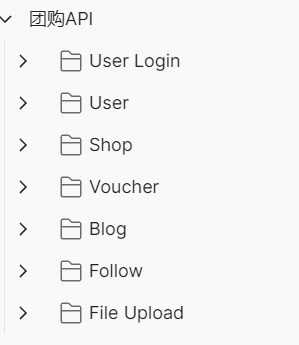
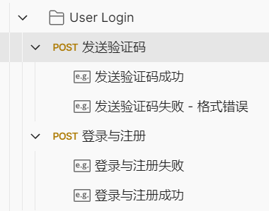
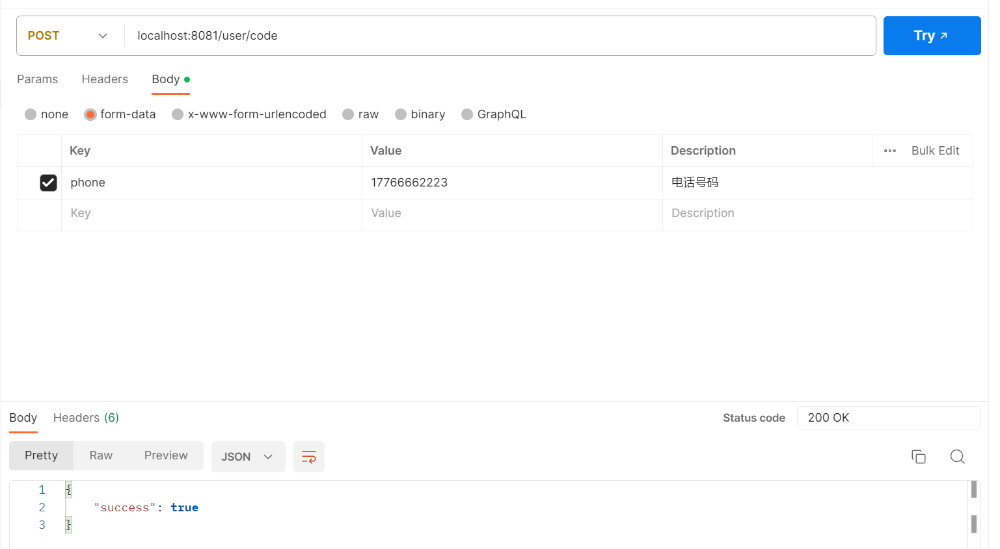
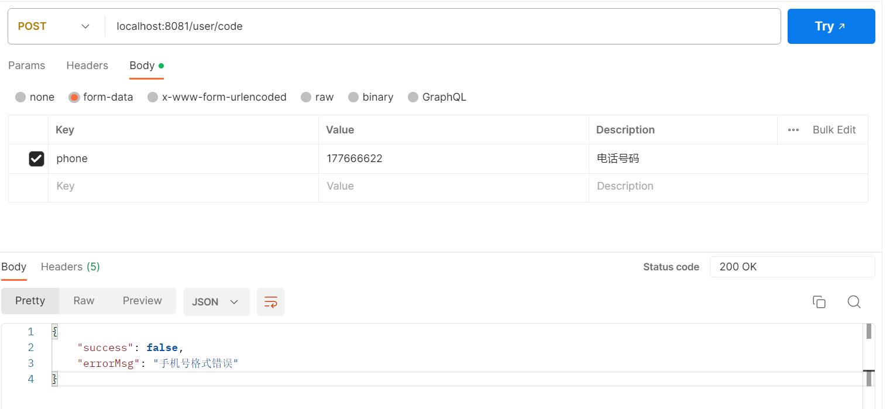

# 接口测试文档

- 说明：本次测试分为7大模块进行
- 测试目录：

## 测试用例

### 模块：User Login

#### - 接口1 - 验证码发送

测试功能：

> **发送验证码**

测试接口：

> **localhost:8081/user/code**

测试步骤：

1. 使用POST方法向接口发送验证码请求。
2. 在请求中包含手机号。
3. 检查响应码是否为200。
4. 检查响应内容是否包含成功的提示信息。

预期结果：

- 响应码为200。
- 响应内容包含成功的提示信息，并收到相关渠道的验证码。

测试结果：

- 测试数据1：

- 测试数据2：

#### - 接口2 - 注册与登录

测试功能：

> **注册与登录**

测试接口：

> **localhost:8081/user/login**

测试步骤：

1. 使用POST方法向接口发送验证码请求。
2. 在请求中包含手机号、验证码。
3. 检查响应码是否为200。
4. 检查响应内容是否包含成功的提示信息。

预期结果：

- 响应码为200。
- 响应内容包含成功的提示信息，并收到相关渠道的验证码。

测试结果：

- 测试数据1：

- 测试数据2：

### 模块：User

### 模块：Shop

### 模块：Voucher

### 模块：Blog

### 模块：Follow

### 模块：File Upload

## 测试报告

### 测试结果

- 接口1 - 用户注册：成功
- 接口2 - 用户登录：成功

### 问题和缺陷

无

### 建议和改进

建议增加更多的异常测试用例，例如无效的用户名或密码等情况。

### 其他补充信息

测试环境：window开发环境 测试工具：Postman 测试人员：黄泽霖、韩处博、谢志贤